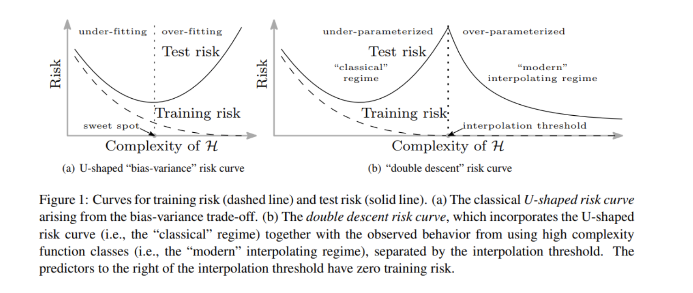
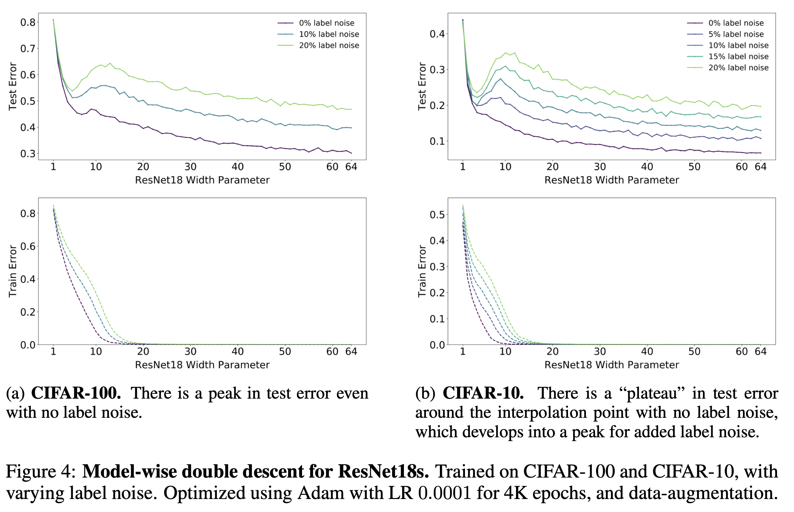
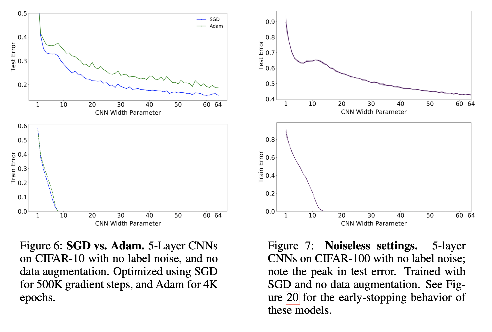
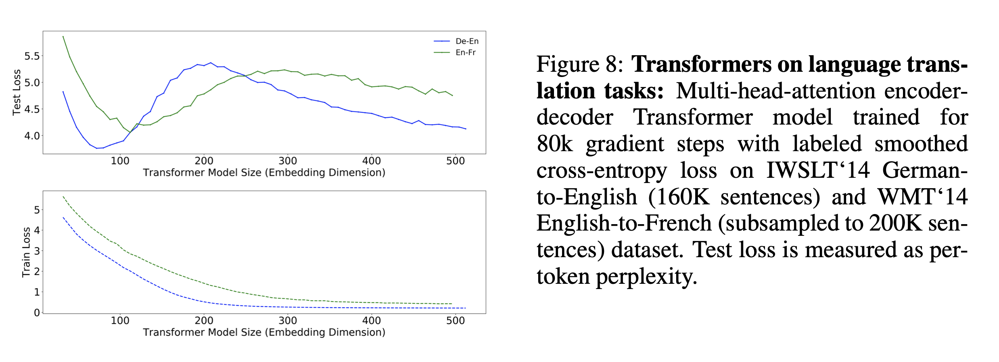
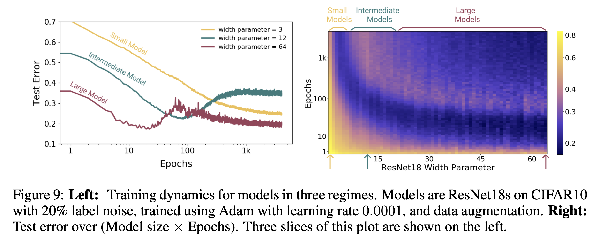
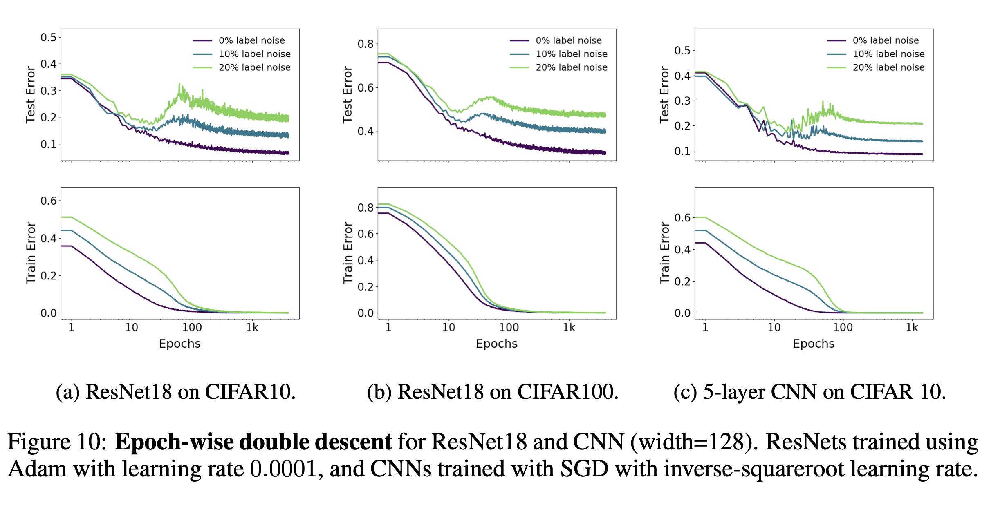
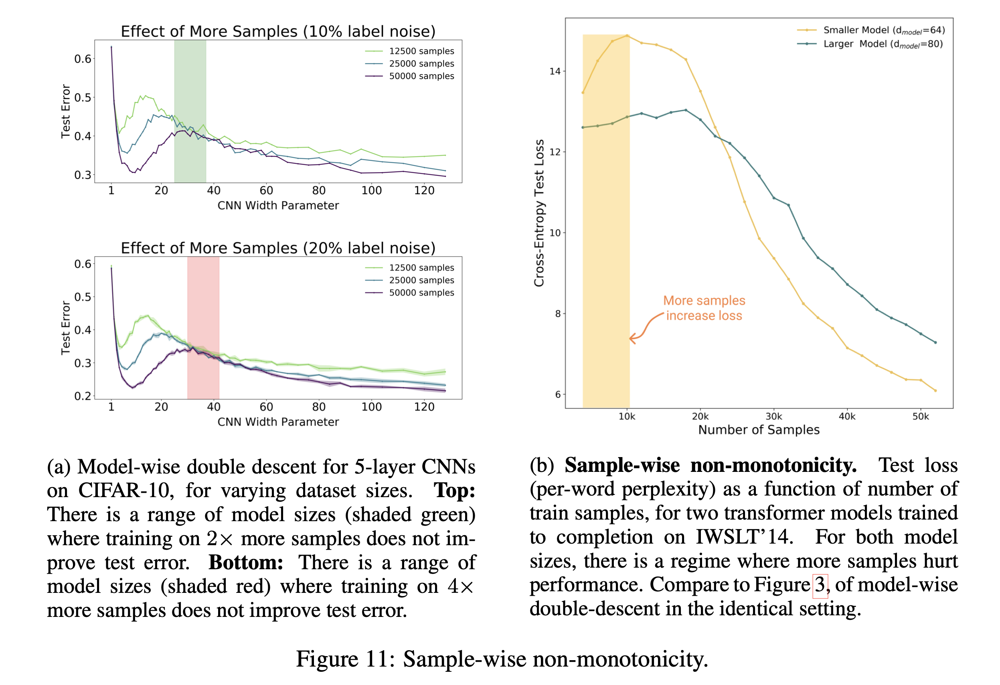

## Deep Double Descent:
Where Bigger Models And More Data Hurt

Harvard University and OpenAI

## References

- [arXiv](https://arxiv.org/pdf/1912.02292.pdf)

## 1.  Summary

ML에서의 아래 3가지 "conventional wisdom"에 대해 실험적 반론을 제시

1. Larger models are always better
2. Longer training time can hurt
3. More data is always better 

## 2.  Prior Work

- 앞서 [Mikhail Belkin et a](https://arxiv.org/abs/1812.11118)l 논문에서 처음으로 **double descent** (DD) 현상 제시

    

- Interpolation threshold 구간 (where the model hits nearly zero training loss) 이후 model complexity를 계속 증가시키면 test loss가 다시 감소 (hence double descent)
- 이런 Double Descent 현상을 Decision Tree와 같은 "simple ML model"과 Random Fourier Features, Fully-connected Neural Networks 와 같은 "simple neural network" 모델에서 관측

## 3. Deep Double Descent

이 논문에서는 Double Descent 현상을 더 다양한 환경에서 실험적으로 관측

### 3.1 Model-wise Double Descent

**ResNets**, **CNN** 그리고 **Transformer**와 같은 모델을 I**mage Classification** 혹은 **Language Translation** 테스크에 적용했을때도 관측

- label-noise, data-augmentation, optimizer 등과 같은 다양한 환경에서 실험
- ResNet

    

- CNN (both SGD and Adam)

    

- Transformer

    

- Explanation

    이처럼 모델 사이즈에 따라 발생하는 Double Descent 현상은 아직 완벽히 이해하지 못했지만 다음과 같은 possible explanation 제안

    > Informally, our intuition is that for model-sizes at the interpolation threshold, there is effectively only one model that fits the train data and this interpolating model is very sensitive to noise in the train set and/or model mis-specification. 
    > 
    > That is, since the model is just barely able to fit the train data, forcing it to fit even slightly-noisy or mis-specified labels will destroy its global structure, and result in high test error. However for over-parameterized models, there are many interpolating models that fit the train set, and SGD is able to find one that “memorizes” (or “absorbs”) the noise while still performing well on the distribution.

### 3.2 Epoch-wise Double Descent

Model Complexity뿐만 아니라 Double Descent는 Training time (i.e. epoch)에 따라 발생

- 모델 사이즈가 클수록 Epoch에 따라 Double Descent 현상이 더 확연하게 발생
    - 빨간색 > 초록색 > 노란색
    - 따라서 작은 모델일수록 **early stopping** is helpful
    - Note log scale on Epoch

- Real world 데이터와 유사한 label-noise 환경에서 특히나 Double Descent 경향이 더 크다

### 3.3 Sample-wise Double Descent

마지막으로 학습 데이터 양을 변화하면서 Double Descent 현상을 관측

- Left (CNN)
    - 10% label-noise 환경에서는 학습 데이터를 2배로 많이쓴 경우가 되려 높은 Test Error
    - 20% label-noise 환경에서는 학습 데이터를 4배로 많이쓴 경우가 되려 높은 Test Error
- Right (Transformer)
    - 위와 마찬가지로 Transformer 모델도 학습데이터가 커질수록 되려 Test Error는 커질 수 있음 !

## Conclusion

- 이 논문에서는 딥러닝 모델, 학습 시간, 데이터 크기 등 여러 실험 환경에서 Double Descent 현상이 발생함을 실험적으로 증명
- 또한 Optimizer, Learning rate에 변화를 줘도 같은 현상 관측
- 이에 대한 이론적인 설명은 아직 하지 못하면서, 이를 Further Work로 제시