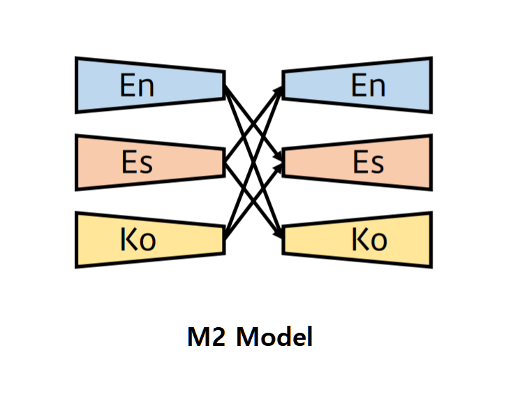
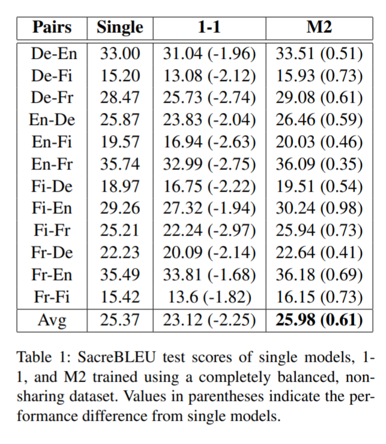
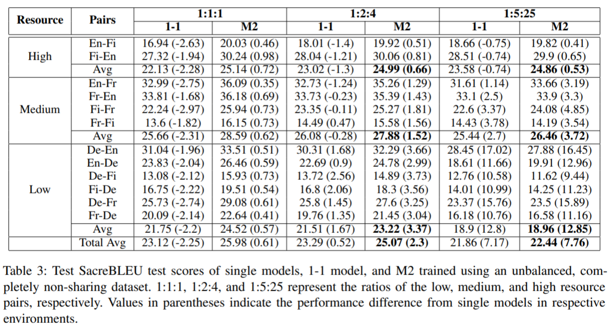
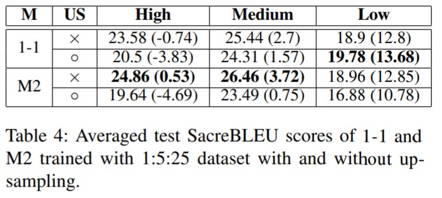
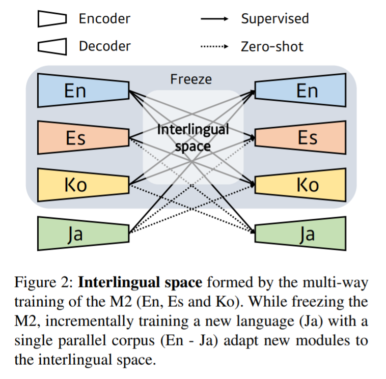
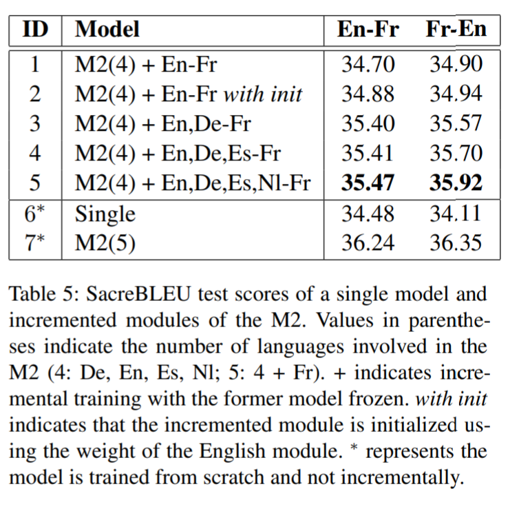
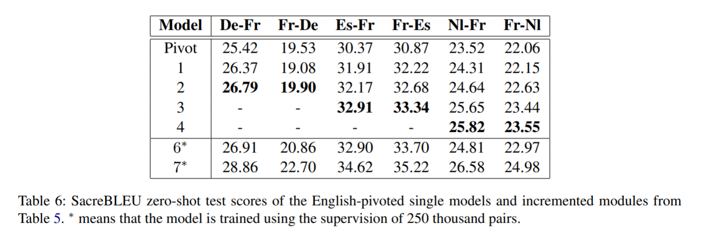
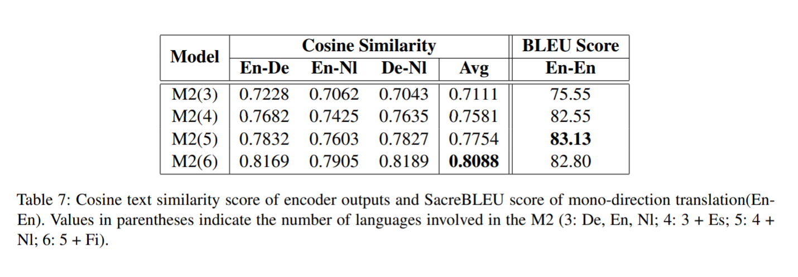

# Revisiting Modularized Multilingual NMT to Meet Industrial Demands
- Lyu et al.
- Kakao Enterprise
  

## Reference
- [arXiv](https://arxiv.org/abs/2010.09402)
  

## Summary
- 산업에서 합리적으로 다국어번역 모델을 설계하는 방법(M2)를 제안한다.
- 학습된 모든 모델을 재학습할 필요 없이 없이 번역 언어를 추가하여 학습, 서비스하는 방법을 제안한다.
- 다양한 실험 조건 및 언밸런스한 데이터 구성에서도 M2가 좋은 성능을 보인다는 것을 실험한다.
- Cosine similarity, Mono-direction 번역 등을 이용하여 M2 모델의 Interlingual Space가 잘 형성되었음을 증명한다. 
  

## Multilingual Translation, 무엇이 문제인가?

- NMT 서비스 (e.g. Kakao i 번역기)를 하면서 지원 언어를 증가시키다 보면, 지원 언어가 너무 많아진다.
- 위 그림에서 왼쪽처럼 단방향 모델(single)을 많이 만들 수도 있지만, 언어가 늘어날 수록 만들어야하는 모델의 수가 2차원적으로 증가한다.
- 최근 연구 동향을 보면 그림에서 가운데 처럼 하나의 인코더, 하나의 디코더로 모든 언어를 커버하는 모델(1-1 모델)이 대세이지만, 이전 몇 연구를 참고하면 1-1 모델은 Capacity Bottleneck이라는 현상이 발생하는 것으로 관찰되었다.
  

### Capacity Bottleneck?
- 모델의 사이즈가 고정되어있다고 할 때, 번역의 성능과 지원 언어의 수 간에 상관관계가 있다는 것을 의미.
- 쉽게 말해서 언어를 많이 지원할 수록 번역의 성능이 떨어진다는 것인데, Zhang et al. (2020)에 의하면 direction을 2배 늘리면 번역 품질이 명확히 떨어진다는 것이 관찰됨.
- 그러나 현업에서는 모델의 사이즈를 무진장 키울 수는 없기 때문에 1-1 모델은 서비스에 그다지 적합하지 않음.
  

### 또 다른 문제 : Data Unbalance
- 보유한 Parallel Corpus에서 각 언어간의 비율이 항상 비슷하진 않다.
- 영어와 같은 언어들의 데이터는 많고, 몇몇 언어는 매우 적은 양의 데이터를 보유할 수 있다. 
- 이럴 경우, 자원이 많은 언어와 자원이 적은 언어 간의 간섭 등이 발생할 수 있고, 자원이 적은 언어는 성능이 떨어질 수도 있다.
  

### 제안하는 모델 : M2

- 같은 언어간의 parameter를 share하는 Firat et al. 2016a의 모델을 확장하여 Modularized Multilingual (M2) 기계번역 모델을 제안한다.
- M2는 위와 같은 그림으로 구성되어있는데, 각 언어별로 인코더, 디코더가 존재한다. 
- inference 타임에 source 언어를 En, target 언어를 Ko로 지정한다면, 영어 인코더에 입력이 들어가고, 한국어 디코더로 최종 번역 결과가 출력되는 방식이다.
  

### 실험 1 : `single` vs `1-1` vs `M2`

- 모델은 Transformer를 사용하였고, 데이터셋은 Europarl에서 몇개의 언어만 가지고 실험을 진행했다.
- 위의 표를 보면 알 수 있듯이, 각 방식의 성능을 테스트 했을 때 M2가 가장 좋은 모습을 보였다.
- 이는 훈련 데이터의 각 언어 비율이 비슷하고, sharing 되지 않은 경우에 해당한다. (언어 sharing은 아래에서 설명)
  

### 실험 2 : 여러가지 환경 및 조건에서의 실험

- Data Sharing : 
    - Sharing : 가령 En-Es-Ko의 병렬데이터가 있을 때, En-Es / En-Ko / Es-Ko / ... 등의 페어를 모두 사용한 케이스
    - 그 중에서 하나만 골라서 (e.g. En-Es 만) 사용한 케이스
- Model Size : 
    - base : (d_model : 256 / FFN_hidden : 1024)
    - large : (d_model : 512 / FFN_hidden : 2048)
- Training Pair :
    - M2M2 : 모든 direction을 모두 학습하고 관찰
    - JM2M2 : 둘 중 한쪽에 반드시 영어를 포함한 direction만 학습하고 관찰
- 실험 결과 :
    - 다양한 조건에서 실험해봐도 M2모델이 single이나 1-1 모델들보다 좋은 성능을 보였다.
  

### 실험 3 : 언밸런스한 환경에서의 실험

- 총 12개의 direction을 아래과 같이 카테고리화 하였음.
    - High (영어, 핀란드어) : En-Fi, Fi-En
    - Medium (프랑스어) : En-Fr, Fr-En, Fi-Fr, Fr-Fi
    - Low (독일어) : De-En, En-De, De-Fi, Fi-De, De-Fr, Fr-De
- 그리고 인위적으로 High, Medium, Low 셋의 비율을 조정하여 언밸런스한 환경을 조성함.
- 이들의 비율을 위 표와 같이 조절해가면서 실험했을 때, 대부분의 경우 M2가 훨씬 나은 성능을 보여줌.
  

### 실험 4 : 언밸런스한 환경에서 Upsampling 실험

- 언밸런스한 환경에서 적은 양의 데이터를 업샘플링해서 실험을 진행.
- 업샘플링시 대부분 성능이 떨어졌는데, 업샘플링된 데이터(Low 리소스)에 오버피팅 되고, High 리소스의 데이터는 언더피팅 되었을 가능성이 있음.
- 업샘플링 하지 않으면 M2가 더 낫지만, 업샘플링한 경우 1-1 보다 나쁜 성능을 보였음.
  

### 실험 5 : Zero-shot 번역 실험

- Zero-shot 번역의 성능도 실험했는데, 여기에서 말하는 zero-shot은 위의 그림처럼 학습하지 않은 pair에 대한 번역을 의미한다.
- 가령 [En, Es, Ko]의 모든 Pair가 학습된 M2 모델에 새로운 언어 Ja를 추가하려고 했을 때, Ja를 제외한 모든 언어(En도) Freeze한 뒤에 En-Ja와 Ja-En만 학습시키고 Ja-Ko, Es-Ja 등을 실험해 봄.

- Fr을 제외하고 학습된 M2 모델에 Fr 언어를 추가하는 실험을 진행
- [XX, XX, ...]-Fr을 새롭게 학습시켜 보았음.
- with init은 다른 언어 인코더의 weight를 가져와서 incremental learning한 경우를 가리킴
- 우선 English pivotted 번역 결과 (En-Fr, Fr-En)의 성능은 위와 같음.

- 당연하겠지만, 피봇([XX, XX]-Fr에서 XX의 수)이 많아질수록 더 좋은 결과를 보임.
- 실험 결과, 다른 언어의 인코더-디코더를 freeze한 채로 zero-shot 번역을 수행해도, supervised 학습 한 결과와 크게 차이가 안 날 만큼 우수했음.
- 모든 언어를 supervised 학습한 6번 (single)과 비슷한 성능이고, 7번 (M2)과 비교해도 성능이 큰 폭으로 차이가 나지는 않았음.
  

### 실험 6 : Interlingual Space에서 언어적 불변성 대한 실험 (zero-shot과 무관)

- M2모델이 학습하는 언어의 개수를 달리하면서 아래 두가지 실험을 진행하고, 이를 통해 언어가 많아질수록 언어적 불변성이 더 높아지는지 실험한다.
- Cosine similarity 실험 : 
    - 언어의 수를 바꿔가면서 M2 모델을 학습했고, 언어의 수가 많아질 수록 병렬 데이터셋에서 병렬 문장들의 유사도를 관찰한다.
    - 실험 결과 언어의 수가 늘어날 수록 병렬 문장들의 cosine 유사도가 높아짐을 알 수 있었고, 이는 언어가 많아질수록 Interlingual Space에서 언어간의 불변성 더 높아지는 것을 의미한다.
- Mono-direction 번역 실험 :
    - Mono-direction 번역 실험을 통해 알 수 있는 것은 소스 문장이 얼마나 잘 보존될 수 있는지를 확인할 수 있다.
    - 대체로 언어의 수가 많아질수록 Mono-direction 번역 성능이 좋아졌고, 이는 언어가 많아질수록 원본 문장이 더 잘 보장된다는 것을 의미한다.
    - 결과적으로, 더 많은 언어를 사용할수록 interlingual space에서 Invariance가 향상된다는 합리적으로 결론을 내릴 수 있다.
  

### 느낀점 
- mBART,mT5 등의 PLM에서도 똑같이 capacity bottleneck이 발생할지 궁금하다.
- M2 방식으로 학습하면 논문에서 언급한 Data diversification이 높아지기 때문에 single보다 잘 되는 것 같다.
- 가령 En-Ko만 배운 En 인코더보다는 En-[Ko, Fr, Ja, ...]을 배운 En 인코더가 더 잘하는 것은 어느정도 자명하다는 생각.
- 1-1 방식보다 성능이 나은 것은 좋지만, 모델을 매우 많이 만드는 것은 여전히 불편하기 때문에 조금은 아쉽다.
