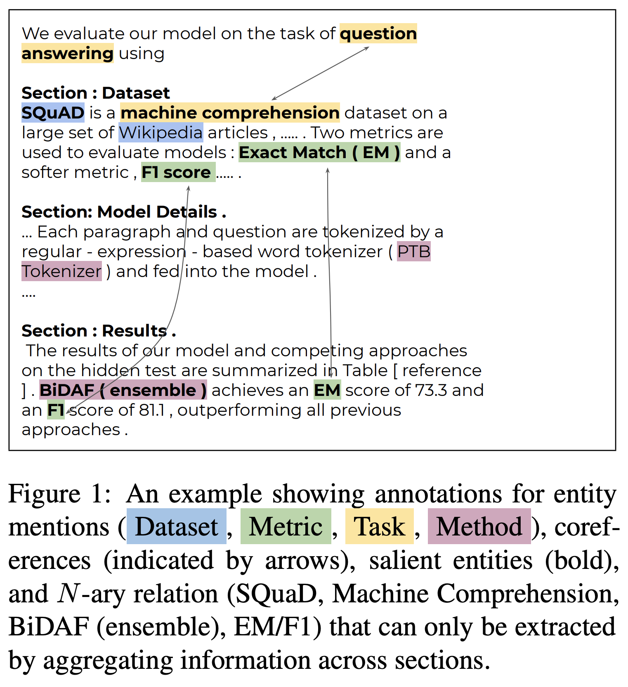
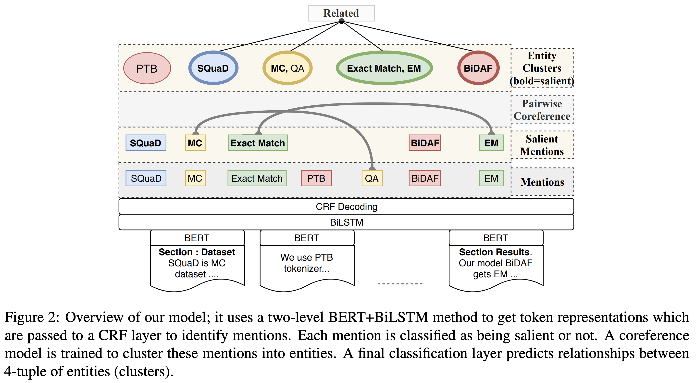
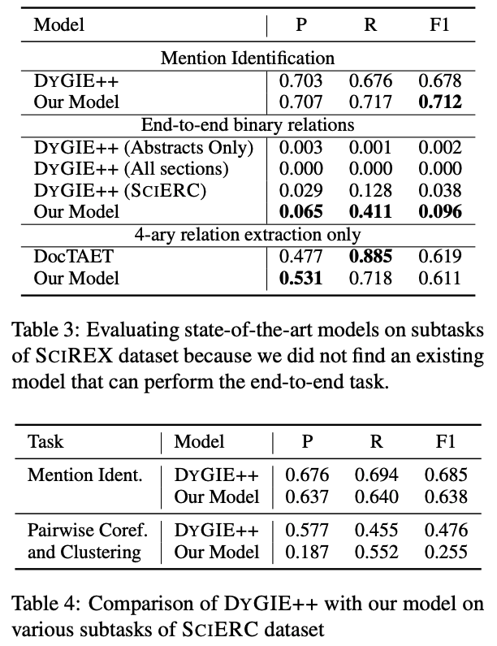
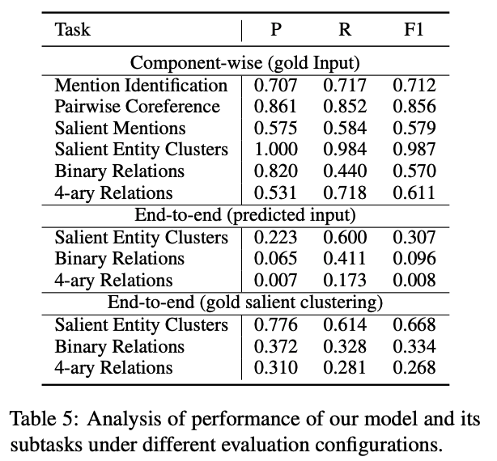

## SciREX: A Challenge Dataset for Document-Level Information Extraction


### References

- SciREX: [ACL 2020](https://arxiv.org/abs/2005.00512)
- [repository](https://github.com/allenai/SciREX)


### Summary



- 대부분의 Information Extraction 모델들은 **문장** 혹은 **문단** 단위에서 엔티티 간 관계 추출
- [Papers-with-Code 데이터](https://github.com/paperswithcode/paperswithcode-data) 활용해 SciREX **데이터셋** 구축:  **488개**의 Annotated 문서
- 문서 단위에서 **과학적인 엔티티를 추출**하고, **엔티티 간 관계를 이해**할 수 있는 베이스라인 모델 제안


### Notes



- 과학을 이해할 수 있는 자연어 이해 기술을 꿈꾸는 **Allen AI**의 후속 연구
- [SciBERT](https://arxiv.org/abs/1903.10676), [SCIERC](https://www.aclweb.org/anthology/D18-1360/)에 이은 **Scientific NLU 연구**의 세 번째 시리즈
- **SciBERT를** 활용해 **섹션 단위**로 Chunking 된 **Passage 임베딩** _(Section 너무 크면 512개 토큰 기준으로 다시 나누어줌)_
- 앞서 SciBERT를 통해 임베딩 된 각 Token Representation을 문서 단위로 늘어 놓아, **Bi-LSTM** 태워 문서 간 문맥 정보 공유
- 기본적으로 다음과 같은 모듈들이 **Multi-task Learning**을 통해 학습
  - **Mention Identification and Classification**: Token Representation들을 CRF에 태워 *identify-then-classify*
  - **Salient Mention Classification**: 앞서 추출된 Mention들이 문서에서 중요한지 판별
  - **Pairwise Coreferece Resolution**: 추출된 Mention들 간 Coreferring 하는지 판별
  - **Mention Clustering**: Coreference Score 높은 Mention들 간 [Hierarchical Clustering](https://ratsgo.github.io/machine%20learning/2017/04/18/HC/)
  - **Relation Extraction**: Cluster 간 4-ary Relation 여부 판별 *(4개 엔티티가 동일 문서에서 나타날 것들인가?)*
- 데이터셋 구축은 **SCIERC**에 대해 훈련된 **SciBERT**를 활용해 **Mention Candidate** 들을 다 뽑아낸 후, *(high Recall)*
- Candidate이 해당 문서에서 실제로 Entity 역할을 수행하는 Span인지 사람이 검수하는 과정을 거침: [가이드라인](https://github.com/allenai/SciREX/blob/master/Annotation%20Guidelines.pdf)

```python
# Jaccard Similarity 활용해 Mention 걸러주는 로직 (to preserve minimum precision)

clean_text = lambda w: re.sub(r"\s+", " ", re.sub(r"[^\w\s\.]", " ", w)).lower().split()

def char_sim(w1: str, w2: str, ng: int = 3, with_abbr: bool = False) -> float:
    char1, char2 = clean_text(w1), clean_text(w2)
    if len(char1) == 0 or len(char2) == 0:
        print(char1, w1, char2, w2)
        return 0.0
    ng = min(min(max([len(x) for x in char1]), max([len(x) for x in char2])), ng)
    char1, char2 = (
        get_n_grams_with_abbr(char1, ng, with_abbr=with_abbr),
        get_n_grams_with_abbr(char2, ng, with_abbr=with_abbr),
    )
    if len(char1) == 0 and len(char2) == 0:
        print(char1, char2, clean_text(w1), clean_text(w2), ng)

    return max(jaccard_similarity(char1, char2), match_abbr(" ".join(clean_text(w1)), " ".join(clean_text(w2))))

entity_similarity_metric = {
    "Material": (lambda x, y: char_sim(x, y, 3, True), 0.101010),
    "Method": (lambda x, y: char_sim(x, y, 3, False), 0.31),
    "Task": (lambda x, y: char_sim(x, y, 3, True), 0.353535),
    "Metric": (lambda x, y: char_sim(x, y, 3, True), 0.111111),
}
```


### Result



- 논문에서 제시한 모든 태스크를 End-to-end로 수행하던 선행 연구 없으므로, **서브 태스크들에 대해서만** 비교
- 문서 내 관계 파악할 수 있어야 하는 **SciREX**에서는 논문에서 제시한 모델이 좋은 성능을 보이지만,
- 문서 혹은 문단 단위 내 관계 파악을 통해 태스크를 수행할 수 있는 **SciERC**에서는 선행 연구가 더 좋은 모습 보임



- **SciREX** 단일에 대한 성능 평가를 보면 어떤 Entity가 **Salient한지 파악하는 태스크**에 어려움을 느끼는 것으로 확인
