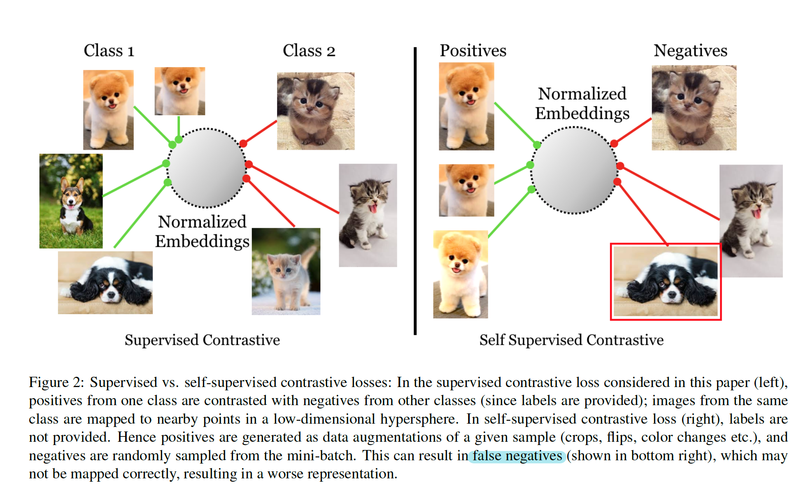
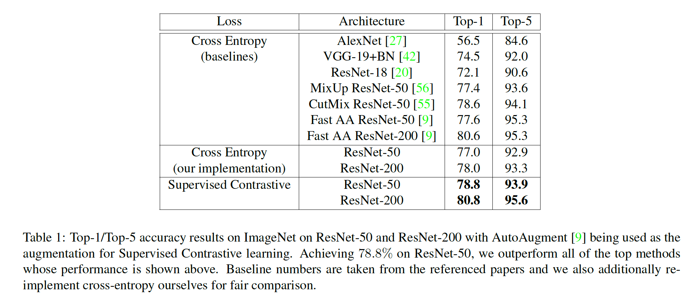

## Supervised Contrastive Learning

### Reference

- [arXiv](https://arxiv.org/abs/2004.11362)
- [code](https://github.com/HobbitLong/SupContrast)

### Summary

- 배경
  - Supervised learning에서 cross entropy를 사용할 때 단점들이 있다.
  - Self-supervised learning에서 contrastive learning이 성공적이었다.
- 방법
  - Embedding space에서 같은 class의 sample은 잡아당기고 다른 class의 sample은 밀어내도록 학습하였다.
  - Contrastive learning에서 대개 single positive sample을 썼던 것을 확장하여 multiple positive samples를 사용하였다.
- 결과
  - ResNet-50, ResNet-200에서 SOTA를 달성하였다.
  - SupContrast를 쓰면 corruption에 robust하고, hyper parameter에 stable 하다.

## Supervised Contrastive Learning

- Anchor에 대해서 같은 class의 sample은 잡아당기고, 다른 class의 sample은 밀어내도록 학습
- 기존 self-supervised contrastive learning 방법에서는 대개 single positive를 썼는데, 여기서는 multiple positives 를 사용
- 어려운 hard positive, hard negative일 수록 gradient를 더 많이 줌 (analytic하게 보임)

#### Representation Learning Framework

- A: data augmentation module
  - Transforms an input image into a randomly augmented image
- E: encoder network
  - Normalized to the unit hypersphere (this normalization always improves performance)
- P: projection network
  - Again normalize this vector to lie on the unit hypersphere
  - Supervised contrastive loss training에만 사용
  - Projection network 보다 encoder representation이 downstream task에서 더 좋은 성능을 보임

### Contrastive Loss

##### Self-supervised Contrastive Loss

- i: anchor, j(i): positive, 나머지: negatives
- 분자를 키우고 분모를 줄여야 함

##### Supervised Contrastive Loss

- Batch 내의 모든 positives가 분자에 contribute
- Self-supervised contrastive loss에서 알려져 있듯이 negative sample 갯수가 늘어날 수록 improve

##### Supervised Contrastive Loss Graiend Properties

- Hard positives/negatives이 weak samples보다 gradient를 더 많이 준다.
- w가 normalization 이전의 projection network output일 때 

- Easy positive z_i • z_j ≈ 1 이면 P_ij가 커지므로 gradient≈0
- Hard positive z_i • z_j ≈ 0 이면 P_ij가 moderate 해지므로 gradient > 0

#### Experiments

- SupContrast 학습 후에 projection head를 randomly initialized linear dense로 바꿔치기 하였음
- Embedding network는 freeze 된 상태로 cross entropy 학습

- SOTA 달성. CutMix, AA 보다는 약간 향상되었음.
- CutMix나 MixUp 같은 친구들을 supervised contrastive learning에도 쓸 수 있을까? ... future work

